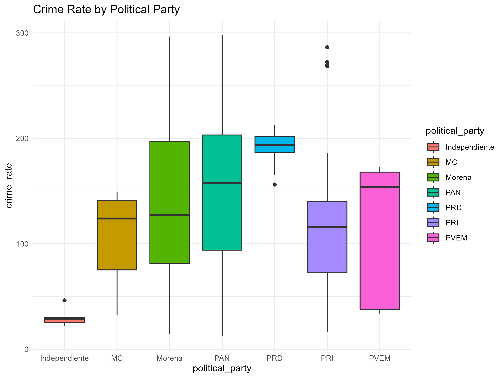

# Educational-Crime-Mexico-Analysis

This repository contains data on educational attainment across Mexico's 32 federal entities, crime statistics, economic indicators, and information about the political parties currently governing each state

## Project Overview 

This case study analyzes the relationship between education, socioeconomic indicators, political parties and crime rates accross the 32 Mexican states and the Republic of Mexico. The goal is to uncover patterns that can be shared publicly to address some of the major factors that cause high crime rates.

## Objectives

* Get and analyze official public information of poverty, unemployment and crime rates
* Investigate political party influence on crime rates
* Analyze possible trends and rates variation from 2015 to 2025
* Visualize trends using Tableau


## Data Sources

* Unemployment Rate (SQL Table) - SNIEG Sistema Nacional de Informacion Estadistica y Geografica
* Poverty Rate (SQL Table) - INEGI 
* Crime Rate (SQL Table) - Observatorio Nacional Ciudadano 
* Political Party (SQL Table) - Wikipedia

## Data Cleaning & Transformation Process

All original datasets were initially in wide format, with multiple columns representing different years or categories. These were transformed into long format to facilitate time-series analysis and easier joins across datasets.

### Cleaning Steps

* Removed null or inconsistent values.
* Standardized entity names across all datasets.
* Ensured consistent data types for joins (entity, year).
* Normalized percentage values.

Example: To prepare the crime rate dataset for time-series analysis and visualization, I transformed it from a wide format (multiple year columns) to a long format (one row per year per entity). This was done using BigQuery's UNPIVOT operation:  

```sql
-- Unpivot crime rate data from wide to long format for time series analysis
-- Source table: project-mexico-analysis.crime_rate.crime_rate_states_2015_2025
-- Output columns: entity, year, crime_rate

CREATE OR REPLACE TABLE `project-mexico-analysis.unpivoted_dataset_states.crime_rate_unpivoted` AS
SELECT
  federal_entity AS entity,
  REPLACE(year, 'year_', '') AS year,
  crime_rate
FROM `project-mexico-analysis.crime_rate.crime_rate_states_2015_2025`
UNPIVOT (
  crime_rate FOR year IN (
    year_2015, year_2016, year_2017, year_2018, year_2019, year_2020,
    year_2021, year_2022, year_2023, year_2024, year_2025
  )
)
```
## Tables Content


## 📄 Table: `crime_rate_long_format_unpivot`

| Column       | Type   | Description                          |
|--------------|--------|--------------------------------------|
| `entity`     | STRING | Name of the federal entity (state)   |
| `year`       | INT    | Year of the recorded crime rate      |
| `crime_rate` | FLOAT  | Crime rate per 100,000 inhabitants   |

---

## 📄 Table: `political_party_long_format_unpivot`

| Column            | Type   | Description                            |
|-------------------|--------|----------------------------------------|
| `entity`          | STRING | Name of the federal entity (state)     |
| `year`            | INT    | Year of the political party record     |
| `political_party` | STRING | Political party in power that year     |

---

## 📄 Table: `poverty_rate_long_format_unpivot`

| Column         | Type   | Description                                         |
|----------------|--------|-----------------------------------------------------|
| `entity`       | STRING | Name of the federal entity (state)                  |
| `year`         | INT    | Year of the poverty rate record                     |
| `poverty_rate` | FLOAT  | Percentage of inhabitants living in poverty         |

---

## 📄 Table: `unemployment_rate_long_format_unpivot`

| Column               | Type   | Description                                      |
|----------------------|--------|--------------------------------------------------|
| `entity`             | STRING | Name of the federal entity (state)               |
| `year`               | INT    | Year of the unemployment rate record             |
| `unemployment_rate`  | FLOAT  | Percentage of unemployed inhabitants             |


## Homologated Entity Names for Analysis

To ensure consistency across datasets, all entity names were standardized by removing trailing spaces and converting them to lowercase. A new reference table was created to facilitate joins with other datasets.

```sql
CREATE OR REPLACE TABLE `project-mexico-analysis.unpivoted_dataset_states.clean_entities` AS
SELECT entity
FROM (
  SELECT TRIM(LOWER(entity)) AS entity FROM `project-mexico-analysis.unpivoted_dataset_states.crime_rate_unpivoted`
  UNION DISTINCT
  SELECT TRIM(LOWER(entity)) FROM `project-mexico-analysis.unpivoted_dataset_states.political_party_unpivoted`
  UNION DISTINCT
  SELECT TRIM(LOWER(entity)) FROM `project-mexico-analysis.unpivoted_dataset_states.poverty_rate_unpivoted`
  UNION DISTINCT
  SELECT TRIM(LOWER(federal_entity)) FROM `project-mexico-analysis.unpivoted_dataset_states.unemployment_rate_unpivoted`
)
ORDER BY entity;
```

## Joined Table With The 4 Tables

A new table named joined_states_information was created to consolidate data from the four main sources for further analysis. The resulting table includes:

* entity
* year
* crime_rate
* political_party
* poverty_rate
* unemployment_rate

```sql
CREATE OR REPLACE TABLE `project-mexico-analysis.joined_datasets_analysis.joined_states_information` AS

WITH
clean_entities AS (
  SELECT DISTINCT TRIM(LOWER(entity)) AS entity
  FROM `project-mexico-analysis.unpivoted_dataset_states.clean_entities`
),

crime AS (
  SELECT TRIM(LOWER(entity)) AS entity, year, crime_rate
  FROM `project-mexico-analysis.unpivoted_dataset_states.crime_rate_unpivoted`
),

party AS (
  SELECT TRIM(LOWER(entity)) AS entity, year, political_party
  FROM `project-mexico-analysis.unpivoted_dataset_states.political_party_unpivoted`
),

poverty AS (
  SELECT TRIM(LOWER(entity)) AS entity, year, poverty_rate
  FROM `project-mexico-analysis.unpivoted_dataset_states.poverty_rate_unpivoted`
),

unemployment AS (
  SELECT TRIM(LOWER(entity)) AS entity, year, unemployment_rate
  FROM `project-mexico-analysis.unpivoted_dataset_states.unemployment_rate_unpivoted`
)

SELECT
  ce.entity AS entity,
  cr.year,
  cr.crime_rate,
  pt.political_party,
  pv.poverty_rate,
  un.unemployment_rate

FROM clean_entities ce
LEFT JOIN crime cr ON ce.entity = cr.entity
LEFT JOIN party pt ON ce.entity = pt.entity AND cr.year = pt.year
LEFT JOIN poverty pv ON ce.entity = pv.entity AND cr.year = pv.year
LEFT JOIN unemployment un ON ce.entity = un.entity AND cr.year = un.year

ORDER BY ce.entity, cr.year;


```
## Exploration and extraction of relevant insights

Different queries where performed to extract relevant information and find correlation patterns between the different indicators and years.

## Most Violent State vs Poorest State vs Unemployment Rate from 2015 to 2025

```sql
SELECT
  entity,
  ROUND(AVG(crime_rate), 1) AS avg_crime_rate_per_100k,
  CONCAT(CAST(ROUND(AVG(poverty_rate), 1) AS STRING), '%') AS avg_poverty_rate_percent,
  CONCAT(CAST(ROUND(AVG(unemployment_rate), 1) AS STRING), '%') AS avg_unemployment_rate_percent
FROM
  `project-mexico-analysis.joined_datasets_analysis.joined_states_information`
GROUP BY
  entity
ORDER BY
  avg_crime_rate_per_100k DESC;
```
## Averages by States

| entity              | avg_crime_rate_per_100k | avg_poverty_rate_percent | avg_unemployment_rate_percent |
|---------------------|-------------------------|--------------------------|-------------------------------|
| colima              | 246.0                   | 27.8%                    | 3.2%                          |
| baja california sur | 244.4                   | 21.6%                    | 3.8%                          |
| baja california     | 233.7                   | 22.1%                    | 2.7%                          |
| aguascalientes      | 206.2                   | 29.9%                    | 3.7%                          |
| republica mexicana  | 200.2                   | 42.2%                    | 3.4%                          |
| ciudad de mexico    | 198.4                   | 27.3%                    | 4.8%                          |
| quintana roo        | 196.4                   | 32.9%                    | 3.6%                          |
| morelos             | 183.2                   | 45.7%                    | 2.2%                          |
| guerrero            | 177.3                   | 65%                      | 1.7%                          |
| guanajuato          | 171.2                   | 40.2%                    | 3.9%                          |
| tabasco             | 167.7                   | 51.1%                    | 6%                            |
| chihuahua           | 153.5                   | 26.9%                    | 3.1%                          |
| coahuila            | 146.5                   | 24.8%                    | 4.4%                          |
| san luis potosi     | 134.1                   | 43.3%                    | 2.9%                          |
| estado de mexico    | 133.2                   | 44.8%                    | 4.4%                          |
| nayarit             | 129.0                   | 35.9%                    | 3.4%                          |
| oaxaca              | 127.0                   | 62.5%                    | 1.8%                          |
| jalisco             | 125.9                   | 29.8%                    | 3%                            |
| durango             | 122.9                   | 40.7%                    | 3.9%                          |
| zacatecas           | 112.1                   | 49.2%                    | 3%                            |
| tamaulipas          | 94.8                    | 32.7%                    | 3.8%                          |
| queretaro           | 87.4                    | 29.4%                    | 4%                            |
| sonora              | 84.5                    | 26.5%                    | 3.9%                          |
| michoacan           | 75.1                    | 48.9%                    | 2.4%                          |
| sinaloa             | 73.5                    | 29.3%                    | 3.1%                          |
| puebla              | 71.1                    | 59.3%                    | 3%                            |
| veracruz            | 71.1                    | 55.2%                    | 2.9%                          |
| hidalgo             | 65.5                    | 49.1%                    | 2.5%                          |
| campeche            | 64.6                    | 46.5%                    | 2.9%                          |
| yucatan             | 54.3                    | 44.2%                    | 2.1%                          |
| nuevo leon          | 44.3                    | 19.5%                    | 3.8%                          |
| tlaxcala            | 31.1                    | 55.9%                    | 3.9%                          |
| chiapas             | 28.6                    | 73.4%                    | 2.7%                          |

## Correlation Between Poverty Rate vs Crime Avg
### Process to find correlation

```sql
SELECT
  CORR(poverty_rate, crime_rate) AS poverty_crime_correlation
FROM
  `project-mexico-analysis.joined_datasets_analysis.joined_states_information`;
```
### Result

| poverty_crime_correlation |
|---------------------------|
| -0.36467106377769876      |


Based on the analysis of state-level data in Mexico, we found a moderate negative correlation between poverty rate and crime rate (–0.36). This suggests that, contrary to common assumptions, states with higher poverty levels tend to report slightly lower crime rates. Possible explanations include underreporting in marginalized areas, rural vs. urban dynamics, and the influence of political or institutional factors. 

## Most Violent States in 2025, Correlation With Political Party

A comparative analysis was conducted on the five most violent states in Mexico, along with the national average (República Mexicana), focusing on crime rates in 2015, 2020, and 2025. Each state's ruling political party during those years was also examined to explore potential correlations between governing policies and crime trends.

```sql
-- Step 1: Get the top 5 most violent states based on average crime rate
WITH top_violent_states AS (
  SELECT 
    entity,
    AVG(crime_rate) AS avg_crime_rate
  FROM 
    `project-mexico-analysis.joined_datasets_analysis.joined_states_information`
  WHERE 
    entity != 'republica mexicana'  -- Exclude national aggregate
  GROUP BY 
    entity
  ORDER BY 
    avg_crime_rate DESC
  LIMIT 5
),

-- Step 2: Get crime rates and political parties for República Mexicana for selected years
republica_mexicana AS (
  SELECT 
    'republica mexicana' AS entity,
    AVG(IF(year = '2015', crime_rate, NULL)) AS crime_2015,
    MAX(IF(year = '2015', political_party, NULL)) AS party_2015,
    AVG(IF(year = '2020', crime_rate, NULL)) AS crime_2020,
    MAX(IF(year = '2020', political_party, NULL)) AS party_2020,
    AVG(IF(year = '2025', crime_rate, NULL)) AS crime_2025,
    MAX(IF(year = '2025', political_party, NULL)) AS party_2025
  FROM 
    `project-mexico-analysis.joined_datasets_analysis.joined_states_information`
  WHERE 
    entity = 'republica mexicana'
),

-- Step 3: Get crime rates and political parties for each of the top states
crime_by_year AS (
  SELECT 
    entity,
    AVG(IF(year = '2015', crime_rate, NULL)) AS crime_2015,
    MAX(IF(year = '2015', political_party, NULL)) AS party_2015,
    AVG(IF(year = '2020', crime_rate, NULL)) AS crime_2020,
    MAX(IF(year = '2020', political_party, NULL)) AS party_2020,
    AVG(IF(year = '2025', crime_rate, NULL)) AS crime_2025,
    MAX(IF(year = '2025', political_party, NULL)) AS party_2025
  FROM 
    `project-mexico-analysis.joined_datasets_analysis.joined_states_information`
  WHERE 
    entity != 'republica mexicana'
  GROUP BY 
    entity
)

-- Step 4: Combine top states with their crime and party data
SELECT 
  c.entity,
  c.crime_2015,
  c.party_2015,
  c.crime_2020,
  c.party_2020,
  c.crime_2025,
  c.party_2025
FROM 
  top_violent_states t
JOIN 
  crime_by_year c
ON 
  t.entity = c.entity

-- Step 5: Add República Mexicana to the result
UNION ALL

SELECT 
  entity,
  crime_2015,
  party_2015,
  crime_2020,
  party_2020,
  crime_2025,
  party_2025
FROM 
  republica_mexicana

-- Step 6: Sort the final result by crime rate in 2025 (descending)
ORDER BY 
  crime_2025 DESC;

```` 
## Results

| entity              | crime_2015 | party_2015 | crime_2020 | party_2020 | crime_2025 | party_2025 |
|---------------------|------------|------------|------------|------------|------------|------------|
| colima              | 75.8       | PRI        | 269.3      | PRI        | 253.2      | Morena     |
| republica mexicana  | 177.6      | PRI        | 197.1      | Morena     | 240.3      | Morena     |
| baja california     | 247.9      | PAN        | 189.0      | Morena     | 239.5      | Morena     |
| aguascalientes      | 145.2      | PAN        | 195.3      | PAN        | 217.2      | PAN        |
| ciudad de mexico    | 156.2      | PRD        | 183.1      | Morena     | 196.0      | Morena     |
| baja california sur | 297.7      | PAN        | 211.3      | PAN        | 193.7      | Morena     |


## Findings

The data reveals a consistent increase in crime rates across most entities, particularly in 2025, where Morena is the ruling party in several of the most violent regions. 

Colima and Baja California saw significant crime rate increases after transitioning to Morena leadership. La República Mexicana, under Morena since 2020, also shows a marked rise in national crime rates.

## Least Violent States in 2025, Correlation With Political Party

A comparative analysis was conducted on the five least violent states in Mexico, along with the national average (República Mexicana), focusing on crime rates in 2015, 2020, and 2025. Each state's ruling political party during those years was also examined to explore potential correlations between governing policies and crime trends.

```sql
-- Step 1: Get the 5 states with the lowest average crime rate
WITH least_violent_states AS (
  SELECT 
    entity,
    AVG(crime_rate) AS avg_crime_rate
  FROM 
    `project-mexico-analysis.joined_datasets_analysis.joined_states_information`
  WHERE 
    entity != 'republica mexicana'  -- Exclude national aggregate
  GROUP BY 
    entity
  ORDER BY 
    avg_crime_rate ASC
  LIMIT 5
),

-- Step 2: Get crime rates and political parties for each of those states
crime_by_year AS (
  SELECT 
    entity,
    AVG(IF(year = '2015', crime_rate, NULL)) AS crime_2015,
    MAX(IF(year = '2015', political_party, NULL)) AS party_2015,
    AVG(IF(year = '2020', crime_rate, NULL)) AS crime_2020,
    MAX(IF(year = '2020', political_party, NULL)) AS party_2020,
    AVG(IF(year = '2025', crime_rate, NULL)) AS crime_2025,
    MAX(IF(year = '2025', political_party, NULL)) AS party_2025
  FROM 
    `project-mexico-analysis.joined_datasets_analysis.joined_states_information`
  WHERE 
    entity != 'republica mexicana'
  GROUP BY 
    entity
)

-- Step 3: Join the two datasets and order by crime rate in 2025
SELECT 
  c.entity,
  c.crime_2015,
  c.party_2015,
  c.crime_2020,
  c.party_2020,
  c.crime_2025,
  c.party_2025
FROM 
  least_violent_states l
JOIN 
  crime_by_year c
ON 
  l.entity = c.entity
ORDER BY 
  c.crime_2025 ASC;
```
## Results

| entity     | crime_2015 | party_2015    | crime_2020 | party_2020    | crime_2025 | party_2025 |
|------------|------------|---------------|------------|---------------|------------|------------|
| tlaxcala   | 53.5       | PRI           | 25.0       | PRI           | 15.2       | Morena     |
| yucatan    | 135.9      | PRI           | 31.0       | PAN           | 17.0       | Morena     |
| chiapas    | 33.9       | PVEM          | 25.1       | Morena        | 17.4       | Morena     |
| campeche   | 17.1       | PRI           | 16.7       | PRI           | 46.1       | Morena     |
| nuevo leon | 46.4       | Independiente | 26.9       | Independiente | 63.8       | MC         |

## Findings

An analysis of the five states with the lowest crime rates in 2025 reveals interesting patterns in relation to political party leadership:

Tlaxcala, Yucatán, and Chiapas all show a consistent decline in crime rates from 2015 to 2025. Each of these states transitioned to Morena leadership by 2025, suggesting a potential link between local governance and improved security outcomes.
Campeche, however, experienced a sharp increase in crime rate in 2025 despite also shifting to Morena, indicating that party affiliation alone may not fully explain crime trends.

Nuevo León presents a unique case: under Independent leadership, crime rates were relatively low, but rose significantly after transitioning to Movimiento Ciudadano (MC) in 2025.

## Correlation Between Parties and Crimes

### Most Violent States

The most violent states in 2025 include Colima, Baja California, Ciudad de México, Aguascalientes, and Baja California Sur, along with the national average (República Mexicana). These states show a notable increase in crime rates over the decade, particularly under Morena leadership in 2025.

- Colima: Crime rose from 75.8 (2015) to 253.2 (2025), with a shift from PRI to Morena.
- República Mexicana: National crime increased from 177.6 to 240.3 under Morena.
- Baja California: Transitioned from PAN to Morena, with crime rising again in 2025.
- Ciudad de México and Aguascalientes also saw increases, despite different party trajectories.

These trends suggest a possible direct impact of Morena’s governance, which is often associated with less aggressive policies toward organized crime and narcotrafficking. While not conclusive, the correlation raises concerns about the effectiveness of current security strategies.

### Least Violent States

The least violent states in 2025 include Tlaxcala, Yucatán, Chiapas, Campeche, and Nuevo León. Most of these states show declining crime rates, especially those that transitioned to Morena leadership.

- Tlaxcala, Yucatán, and Chiapas saw consistent drops in crime after shifting to Morena.
- Campeche and Nuevo León, however, experienced crime rate increases, despite different political paths (Morena and Movimiento Ciudadano, respectively).

This mixed outcome indicates that party affiliation alone is not a definitive predictor of crime trends. Local governance, historical context, and specific policy implementations play a significant role.

### Political Influence Analysis

```r

This boxplot shows the distribution of crime rates across regions governed by different political parties in Mexico.



The plot was generated using this R script:
aggregate(cbind(crime_rate, poverty_rate, unemployment_rate) ~ political_party,
          data = joined_states_information, mean)

ggplot(joined_states_information, aes(x = political_party, y = crime_rate, fill = political_party)) +
  geom_boxplot() +
  theme_minimal() +
  labs(title = "Crime Rate by Political Party")

```

### Graph Observations

* Independiente shows very low crime rates and little variation.
* Morena, PAN and PRD have higher median crime rates and larger spread.
* PVEM also shows a broad distribution.
* MC and PRI are somewhere in the middle.


## Crime Over Time Variation

This project includes a Tableau graph showing how crime has changed over time.

### How it was created
1. Data was loaded into Tableau Desktop.
2. A time-series line chart was built with crime incidents per year.
3. The visualization was exported and embedded into this project.

### Graph
  

## Key Notes

While the overall national trend shows fluctuations, including a notable peak around 2018-2019 followed by a slight decrease or stabilization towards 2025, the individual state trends vary significantly. Some states experience persistently high crime rates (e.g., Colima, Guanajuato, Baja California), while others maintain relatively lower levels (e.g., Yucatán, Tlaxcala). Additionally, other states like Zacatecas show notable improvement, while others, such as Tabasco, experienced a deterioration in peace during this period, highlighting the varied impact of crime and security strategies at a sub-national level


